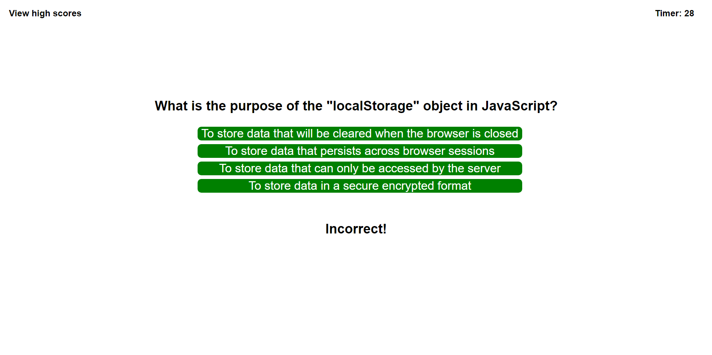

# Brandon Web API Quiz Challenge 4

[Live deploy link](https://bwing2.github.io/brandon-web-api-quiz-challenge-4/)

## Description

This week's challenge was to create a Javascript quiz completely from scratch, using everything I have learned from HTMl, CSS, and JavaScript. This was the most challenging project I have done, as there was so many different factors that went into making everything work correctly. The hardest part was figuring out how to save user data in the local storage. Another big challenge was figuring out how to incorporate all of the timing related elements, including setTimeout, setInterval, and clearInterval to have a responsive user experience. I learned a lot from this project, especially the importance of understanding the DOM to target different elements on a webpage.

## Installation

1. Go to repository main page.
2. Click the green `<> Code` button.
3. Click the SSH button under the Clone heading, and copy the link.
4. Open the terminal.
5. `cd` into the location you want the file to be stored.
6. type `git clone`, and then paste the URL that was copied.
7. Press enter, and you should see a message containing "Cloning into 'directory name'...",meaning you are successful.
8. Open VS Code using `code .` and the copied repository should be there.

## Usage

1. Read the instructions on the the quiz homepage.
2. Click the green `Click here to start the quiz!` to start.
3. Choose one of the four answers in response to the question.
4. After choosing an answer, the text "Correct!" or "Incorrect!" will appear below the choices for one second.
5. Once all questions are answered or the user runs out of time, the end screen will appear displaying a score from one to ten based off correct answers.
6. The user can then enter their name or initials and click submit.
7. The user will be redirected to another webpage that displays all current highscores.
8. The highscore page also displays buttons to remove all highscores, or go back to the quiz homepage.

### Quiz Home Page

### Correct Answer

### Incorrect Answer

### End Screen

### Ran Out of Time End Screen

### High Scores Page

## License

MIT License

Copyright (c) 2023 Brandon Wing

Permission is hereby granted, free of charge, to any person obtaining a copy of this software and associated documentation files (the "Software"), to deal in the Software without restriction, including without limitation the rights to use, copy, modify, merge, publish, distribute, sublicense, and/or sell copies of the Software, and to permit persons to whom the Software is furnished to do so, subject to the following conditions:

The above copyright notice and this permission notice shall be included in all copies or substantial portions of the Software.

THE SOFTWARE IS PROVIDED "AS IS", WITHOUT WARRANTY OF ANY KIND, EXPRESS OR IMPLIED, INCLUDING BUT NOT LIMITED TO THE WARRANTIES OF MERCHANTABILITY, FITNESS FOR A PARTICULAR PURPOSE AND NONINFRINGEMENT. IN NO EVENT SHALL THE AUTHORS OR COPYRIGHT HOLDERS BE LIABLE FOR ANY CLAIM, DAMAGES OR OTHER LIABILITY, WHETHER IN AN ACTION OF CONTRACT, TORT OR OTHERWISE, ARISING FROM, OUT OF OR IN CONNECTION WITH THE SOFTWARE OR THE USE OR OTHER DEALINGS IN THE SOFTWARE.
